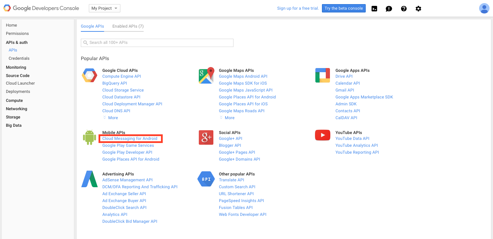
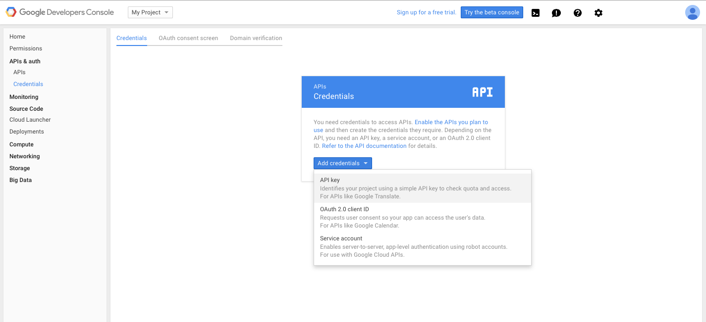
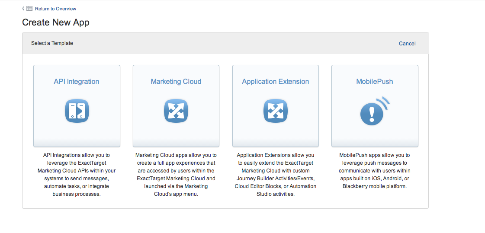
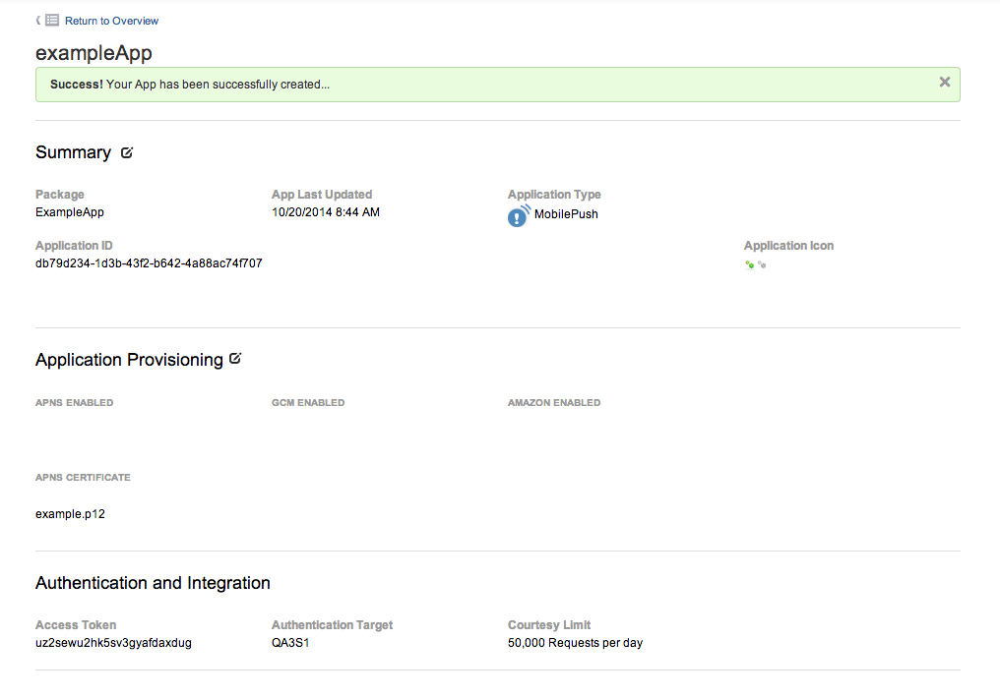
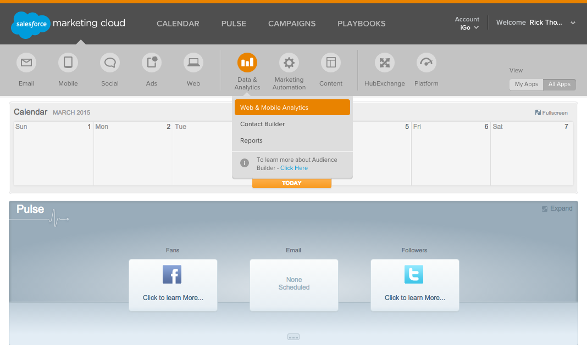

# README

>Marketing Cloud Learning Apps are free to use but are not official Salesforce.com Marketing Cloud products and should be considered community projects--these apps are not officially tested or documented. For help on any Marketing Cloud Learning App please consult the Salesforce message boards or the issues section of this repository. Salesforce Marketing Cloud support is not available for these applications.

1. [About](#0001)

    1. [Marketing Cloud App Center](#0002)

    2. [Push Notifications](#0003)

    3. [Subscriber Key](#0004)

    4. [Tags](#0005)

    5. [Beacon and Geofence Messages](#0006)

    6. [Analytics](#0006b)

2. [Implementation on Android](#0007)

    1. [Prerequisite Steps](#0008)

        1. [Provision Apps with Google](#0009)

        2. [Create your apps in the App Center](#0010)

            1. [Add app to App Center](#0011)

            2. [Integrate App Center app](#0012)
    2. [Setting up the SDK](#0013)

    3. [Implementing the SDK Push Notifications](#0014)

    4. [Subscriber Key Implementation](#0015)

    5. [Tag Implementation](#0016)

    6. [Beacon and Geofence Message Implementation](#0017)

    7. [Implement Analytics in your Mobile App](#0018)

<a name="0001"></a>
# About

This project provides a template for creating a mobile app (Android or iOS) that uses the Journey Builder for Apps SDK.  It is also a UI for exploring its features and provides a mechanism to collect and send debugging information to learn about the workings of the SDK as you explore.

The code in this repository includes all of the code used to run the fully functional APK, including an App ID and Access Token to let you test and debug the application. To create a new app, the following keys must be set with your own values within the corresponding file.

<a name="0002"></a>
## Marketing Cloud App Center

App Center is the central development console for using Fuel’s APIs and building Marketing Cloud apps.

In order to connect your app to the Marketing Cloud, you must first create a MobilePush app in the App Center. 

Each app in App Center represents an application connected to the Marketing Cloud. App Center currently manages four types of connected apps:

* *API Integration* allows you to leverage the Marketing Cloud APIs. Create an API Integration app when you want to use Fuel APIs to automate tasks or integrate business systems. API Integration apps utilize an OAuth2 client credentials flow to acquire access tokens directly from the Fuel authentication service.

* *Marketing Cloud apps* represent apps that live within the Salesforce Marketing Cloud and launch via the Marketing Cloud app menu. Marketing Cloud apps include custom apps built by your organization or apps installed from the Salesforce Marketing Cloud HubExchange. Marketing Cloud apps utilize a JSON Web Token (JWT) to acquire access tokens on behalf of logged-in users.

* *Application Extensions* allow you to extend the Marketing Cloud with custom Journey Builder activities, Cloud Editor Blocks, and Automation Studio activities.

* *MobilePush apps* represent apps built for the iOS, Android, or Blackberry mobile platforms that use MobilePush to communicate with their users via push messages. The Salesforce Marketing Cloud classifies MobilePush apps as consumer-grade applications and utilize long-lived limited-access tokens.

If you haven’t already, you should [create an App Center account](https://appcenter-auth.exacttargetapps.com/create).

If you have an App Center account, you can [log in to that account](https://appcenter-auth.exacttargetapps.com/redirect).

###Place the App Center Credentials in your Application
On Android, we utilize a 'secrets.xml' file to contain the application credntials given by the App Center above. Inside the secrets.cml file, set the following:

**secrets.xml**

1. `app_id`: the App ID for your development app as defined in the App Center section of the Marketing Cloud.

2. `gcm_sender_id`: the Google Cloud Messaging ID as defined in the Google Cloud Developers Console for your app.

3. `access_token`: the Access Token for your development app as defined in the App Center section of the Marketing Cloud.

> Note: You can use different keys for the staging/testing phase and the production phase.  Staging/testing keys are indicated by the prefix `staging_`. By default, the Learning App will utilize the `staging_ app_id`, `access_token`, and `gcm_sender_id`.

#Features

<a name="0003"></a>
## Push Notifications

MobilePush lets you create and send targeted push messages based on cross-channel consumer data to encourage app usage and deliver increased ROI.  With MobilePush, you view how users navigate through your app. Because MobilePush is built on the Salesforce Marketing Cloud, you can easily integrate push message campaigns with any email, SMS, or social campaign.

<a name="0004"></a>
## Subscriber Key

A subscriber is a person who has opted to receive communications from your organization. 

A valid email address is required to receive emails, and a valid phone number is required to receive SMS messages. You can track additional information about subscribers using profile and preference attributes.

The Subscriber Key identifies your subscribers.

It can be set to a specific value provided by the subscriber, such as a phone number, email address, or other appropriate value. It must be a value that you choose that identifies a unique person. The model is that one subscriber may have multiple devices. For example, Kevin has 3 devices. The subscriber key identifies Kevin, not his 3 devices. 

Keep in mind that the Marketing Cloud web UI uses a send-by-subscriber model. This means:

* The subscriber key is used to identify the devices that will be sent to. This means if you create a filtered list based on an attribute, it will identify the subscribers who own the devices that have the selected attributes and send to all devices owned by that contact. 
* The subscriber key is not required, but it is strongly recommended. 

The Salesforce Marketing Cloud interface, as well as the Fuel REST API, support functionality for subscribers identified with a subscriber key.

<a name="0005"></a>
## Tags

Tags let you implement contact segmentation on a per-device level. Additionally, use tags to collect information from the mobile app for unstructured data or data that can contain many potential unknown values. For example, you can use tags when the number of potential attribute names exceeds the number of potential values of an individual attribute, such as the favorite brand specified by a contact. Note that tags are device specific, but one-way. Each device has its own set of tags, but a new device will not pull down tags from the Marketing Cloud. If you create a filtered list based on tag data, be aware that sending from the UI will result in sending to all devices owned by subscribers that have any device with that tag.

<a name="0006"></a>
## Beacon and Geofence Messages

You can use the location capabilities of the *JB4A SDK* to target messages to contacts in selected geographic locations. The SDK pre-downloads geofence messages and triggers those messages when a mobile device crosses a geofence boundary. Note that the message must pre-exist on the device before the device crosses the geofence or encounters a beacon. These messages are downloaded whenever:

* The application is brought to the foreground / started.
* The device moves across the "magic" geofence. The "magic" fence is a geofence with a radius of 5K, and a center point  set to the last-known GPS fix. If the device moves outside that magic fence, the OS will notify the SDK, and the SDK will search for new geofences and beacons to monitor, along with messages for those fences and beacons.

For beacon messages, the app triggers these messages when a mobile device comes into proximity with a known beacon. To use this functionality:

1. The account must have access to both MobilePush and Location Services.
2. Ensure that you use version 7.8.0 or earlier of Google Play Services to enable geolocation for your app.
3. You must receive user permission to implement location services.

<a name="0006b"></a>
## Analytics

Mobile Application Analytics enables marketers to gather mobile app actions and behaviors from users and provides powerful visualizations of the data. The data helps you make informative decisions about how to structure your customer journeys, design your client-facing experiences, and tailor your digital marketing campaigns. The collected data is also available inside the Salesforce Marketing Cloud, ready to be used to segment messaging lists, provide highly personalized messaging content, and drive 1:1 Custom Journeys.

<a name="0007"></a>
# Implementation on Android
<a name="0008"></a>
## Prerequisite Steps

Before you can implement the SDK inside your Android application, you must first:

1. Provision Apps with Google.  
2. Create your apps in the App Center.

<a name="0009"></a>
### Provision Apps with Google

These steps are key to receiving push messages in your app.

Review the Android documentation regarding the integration of your Android mobile app with Google Cloud Messaging found in [Google Cloud Messaging (GCM) HTTP connection server.](https://developer.android.com/google/gcm/http.html)

1. Log into the [Google Developers Console](https://console.developers.google.com/) and click **Create a project...**.

    1. Enter a name for your project in the **PROJECT NAME** field.
    2. Use the suggested default ID for your project or click in **Edit** to enter a custom one.
    3. Click Create.

2. Record the Project Number value supplied by the Google Cloud Console. You will use this value later in your Android application code as the **Google Cloud Messaging Sender ID**.

    

3. In the the left menu, click **APIs** (**APIs & auth** section).
4. Enable **Google Cloud Messaging for Android** by clicking Google Cloud Messaging For Android:

    

5. Click "Enable API".

    

6. Click **Credentials** in the left menu.
7. Click **Add credentials** → **API key**, and select **Server key** in the dialog.

    

    


8. Click **Create** and copy the **API KEY** value from the **Server application**.

9. Use the API Key from the server application created above to add to your MobilePush app in the *Create your apps in the App Center* step. And use the project number to set the `gcm_sender_id` in your project.

<a name="0010"></a>
### Create your apps in the App Center

In order to connect your app to your Marketing Cloud account, you must follow these steps:

1. Add app to App Center.
2. Integrate the App Center app to your Marketing Cloud account.
3. Add the Provisioning info created in the GCM Console to the app in the App Center.

<a name="0011"></a>
#### Add app to App Center

To create a new MobilePush app:

1. [Log in to the App Center](https://appcenter-auth.exacttargetapps.com/redirect) ([create an account](https://appcenter-auth.exacttargetapps.com/create) if necessary).

2. Create a new app and select the MobilePush template.

    

3. Fill in, at a minimum, the mandatory fields in this form.

    

    *Depending on your setup, repeat this process if you plan on using different instances for production and development.*

    Note the following about the required fields:

      1. The **Name** can be anything you choose.

      2. The **Package** has no correlation to anything outside of the MarketingCloud ecosystem and can be **any** unique identifier for your application.

      3. The **Description** and **MobilePush Icon** fields are optional but will help you identify your application within your Marketing Cloud account. 

4. Click **Next** in order to integrate this new app with your Marketing Cloud account.

<a name="0012"></a>
#### Integrate App Center app

The MobilePush app created in the App Center must be connected to a specific Marketing Cloud account. You must have login credentials for your Marketing Cloud account in order to connect this MobilePush app to the correct Marketing Cloud account.

Follow these steps in order to connect this MobilePush app to the correct Marketing Cloud account:

1. Select an account (or New…) in the **Account** drop-down.

    

2. Select the **Production ExactTarget Account** button *unless otherwise instructed by your Salesforce Marketing Cloud relationship manager.*

3. Click **Link to Account**.

    A popup window (pictured below) will appear.

    

4. In an Enterprise 2.0 account, ensure that you select the correct business unit for your app integration.

5. Click **Integrate**.

6. In the GCM Client section, enter the server API KEY previously created in the [Provision Apps with Google](#0009) step. You can get this key by entering in the [Google Cloud Console](https://console.developers.google.com/).

    

7. When you have all the fields required for your application’s platform(s) populated, click *Next*.

8. Review the information you provided, check for any errors, and click **Finish**.

    You should be presented with a *Success!* message and an application details screen. Any of the areas can be edited by clicking the edit icon associated with the **Summary** or **Application Provisioning** sections.

    

Record the **Application ID** and the **Access Token**, as they will be used later in the secrets.xml file.


<a name="0013"></a>
## Setting up the SDK

The `configureSDK` method of the ETPush class configures the SDK to point to the correct code application.

Call this from your Application's `Application.onCreate()` method. This initializes ETPush.

When `configureSDK()` is called for the first time for a device, it will get a device token
from Google and send to the MarketingCloud.

In `configureSDK()` you must set several parameters:

  * `app_id` and `access_token`: These values are taken from the Marketing Cloud definition for your app.

  * `gcm_sender_id` for the push notifications: This value is taken from the Google API console.

  * You can also set whether you enable location services, cloud pages, analytics, Web and Mobile Analytics, and proximity (beacons).

To set the logging level, call `ETPush.setLogLevel()`.

<a name="0014"></a>
## Push Notifications

Update the following files in your project:

1. secrets.xml
2. AndroidManifest.xml
3. build.gradle
4. app/build.gradle
5. ApplicationClass.java

**Secrets.xml**

The SDK can now be configured with the App ID and Access Token, as explained in the *About* section.  Update `app_id` and `access_token` with their respective values.

**AndroidManifest.xml**
[view the code](/app/src/main/AndroidManifest.xml#L5-L20)

```xml
    
    <!--
        As of 2016-02, the SDK's manifest is merged into your apps
        manifest during the build process. As a result, you no longer
        need to include any SDK based permissions, activities,
        receivers or services in the manifest. Much simpler eh?

        In fact, the only required element of this Manifest is the
        Application's android:name= key.

        **** UNLESS **** you're using location.
        Since we're using location, the following two permissions
        must be manually included.
    -->

    <uses-permission android:name="android.permission.ACCESS_FINE_LOCATION" />
    <uses-permission android:name="android.permission.RECEIVE_BOOT_COMPLETED" />
```

**build.gradle**

Add the following repository:
[view the code](/build.gradle#L27-L27)

```gradle
allprojects {
    repositories {
        jcenter()
        mavenCentral()
        maven {
            url "http://salesforce-marketingcloud.github.io/JB4A-SDK-Android/repository"
        }
    }
}
```
**app/build.gradle**

Include the following dependencies in your application's app/build.gradle file:
[view the code](/app/build.gradle#L44-L44)

```gradle
dependencies {
    /* SDK */
    compile('com.exacttarget.etpushsdk:etsdk:4.5.0@aar') {
            transitive = true;
    }
}
```

**ApplicationClass.java**

The boolean parameters `ANALYTICS_ENABLED`, `CLOUD_PAGES_ENABLED`, `WAMA_ENABLED`, `LOCATION_ENABLED` and `PROXIMITY_ENABLED` enable certain functionalities of the SDK; however, they are not required for the push notifications themselves to function. Push notifications will still be sent even if all are set to false.

We provide a "builder" object, to be used when configuring the SDK. 

```java
ETPush.configureSdk(new ETPushConfig.Builder(this)
                .setEtAppId(getString(R.string.app_id))
                .setAccessToken(getString(R.string.access_token))
                .setGcmSenderId(getString(R.string.gcm_sender_id))
                .setLogLevel(BuildConfig.DEBUG ? Log.VERBOSE : Log.ERROR)
                .setAnalyticsEnabled(ANALYTICS_ENABLED)
                .setLocationEnabled(LOCATION_ENABLED)
                .setPiAnalyticsEnabled(WAMA_ENABLED)
                .setCloudPagesEnabled(CLOUD_PAGES_ENABLED)
                .setProximityEnabled(PROXIMITY_ENABLED)
                .build()
        , this // Our ETPushConfigureSdkListener
);
```

Each of the SDK features can be enabled or disabled by passing a boolean value to their respective set* methods. For example, using `.setAnalyticsEnabled(False)` would disable the analytics portion of the SDK.

Note: The configureSDK call *must* be made within the Application Class's `onCreate()` method.
    [view the code](/app/src/main/java/com/salesforce/marketingcloud/android/demoapp/ApplicationClass.java)


<a name="0014"></a>
## Subscriber Key Implementation

1. Create a new activity called `SettingsActivity` that extends `AppCompatActivity` in your project.

2. Create a new fragment called `SettingsFragment` that extends `PreferenceFragment`.

3. Create an instance of the `SettingsFragment` in the `SettingsActivity` class, and add the following code to the `onCreate()` method:
    [view the code](/app/src/main/java/com/salesforce/marketingcloud/android/demoapp/SettingsActivity.java)
    
    ```java
    getFragmentManager().beginTransaction().replace(android.R.id.content, new SettingsFragment()).commit();
    ```
4. Create a new file called [preferences.xml](/app/src/main/res/xml/preferences.xml) in res/xml that will be the settings view.

5. Reference the preferences.xml file in the `onCreate()` method in the SettingsFragment class with the following code: `addPreferencesFromResource(R.xml.preferences);`

6. Add a private attribute SharedPreferences sp and set it as the default shared preference:

    [view the code](/app/src/main/java/com/salesforce/marketingcloud/android/demoapp/SettingsFragment.java)
    ```java
    private SharedPreferences sp;
    …
    this.sp = getActivity().getPreferences(Context.MODE_PRIVATE);
    ```

7. Add a private attribute pusher, the instance of ETPush:

    [view the code](/app/src/main/java/com/salesforce/marketingcloud/android/demoapp/SettingsFragment.java)
    ```java
    private ETPush pusher;
    …
    this.pusher = ETPush.getInstance();
    ```
8. Now create the reference to the EditTextPreference from preferences.xml and set the value stored in Settings Preferences. Add an `OnPreferenceClickListener()` to open a dialog with input for the user to enter their subscriber key.  This value is stored in the Settings Preferences and will be passed to the pusher.

    [view the code](/app/src/main/java/com/salesforce/marketingcloud/android/demoapp/SettingsFragment.java#L94-L104)
    ```java
    SharedPreferences.Editor editor = sp.edit();
    editor.putString(KEY_PREF_SUBSCRIBER_KEY, newSubscriberKey);
    editor.commit();
    …
    pusher.setSubscriberKey(newSubscriberKey);
    ```

It can take up to 15 minutes for the new value to be recorded in the Contact Record. If an internet connection is not available when the update is made, the SDK will save the update and send it whenever the network becomes available.

<a name="0016"></a>
## Tag Implementation

This feature is implemented in Settings Preferences.  The subscriber key feature must be implemented as described in this guide in order for the following steps to work.

1. Add a set of tags as a private attribute.

    [view the code](/app/src/main/java/com/salesforce/marketingcloud/android/demoapp/SettingsFragment.java#L65)
    ```java
    private Set<String> allTags;
    ```

2. For the implementation of this feature, an instance of `PreferenceScreen` is needed to display the tags dynamically on the screen.
   
    [view the code](/app/src/main/java/com/salesforce/marketingcloud/android/demoapp/SettingsFragment.java#L68)
    ```java
    private PreferenceScreen prefScreen;
    ```

3. In the `onCreate()` method, set the values for `prefScreen`.

    [view the code](/app/src/main/java/com/salesforce/marketingcloud/android/demoapp/SettingsFragment.java#L81)
    ```java
    this.prefScreen = getPreferenceScreen();
    ```

4. To display the tags on screen, call these methods inside the `onCreate()` method:

    [view the code](/app/src/main/java/com/salesforce/marketingcloud/android/demoapp/SettingsFragment.java#L83-L92)
    ```java
    this.allTags = this.pusher.getTags() != null ? this.pusher.getTags() : new HashSet<String>();
    storeAllTags(this.allTags);
    ````

    The `storeAllTags(Set<String> tags)` method saves the tags in Preferences and populates the `allTags` attribute with all of the stored tags.

5. To display the tags on screen, call these methods inside the `onCreate()` method:

    [view the code](/app/src/main/java/com/salesforce/marketingcloud/android/demoapp/SettingsFragment.java#L145)
    ```java
    configureTags();
    ````

    The `configureTags()` method renders the tags section, a clickable `EditTextPreference` to add a new tag and the tags from allTags with checkboxes to enable/disable the tag.

<a name="0017"></a>
## Beacon and Geofence Messages Implementation

1. In your application’s app/build.gradle file add the following dependence (required for applications that will run on devices with Android OS < 5.0):
    
    [view the code](/app/build.gradle#L40-L44)
    ```gradle
    dependencies {
        /* SDK */
        compile('com.exacttarget.etpushsdk:etsdk:4.5.0@aar') {
            transitive = true;
    }
    ```
2. In your AndroidManifest, add the *JB4A SDK Permissions for location and region monitoring*, and the ETLocation Receiver and Service required to receive the push notifications based on the location of the customer.

    [view the code](/app/src/main/AndroidManifest.xml)
    ```xml
    <uses-permission android:name="android.permission.ACCESS_FINE_LOCATION" />
    <uses-permission android:name="android.permission.RECEIVE_BOOT_COMPLETED" />
    ```
3. In your ApplicationClass, set the `LOCATION_ENABLED` parameter to true:

    [view the code](/app/src/main/java/com/salesforce/marketingcloud/android/demoapp/ApplicationClass.java)
    ```java
    public static final boolean LOCATION_ENABLED = true;
    ```
4. In your ApplicationClass, set the `PROXIMITY_ENABLED` parameter to true:

    [view the code](/app/src/main/java/com/salesforce/marketingcloud/android/demoapp/ApplicationClass.java)
    ```java
    public static final boolean PROXIMITY_ENABLED = true;
    ```


<a name="0018"></a>
## Implement Analytics in your Mobile App

**ApplicationClass.java**

In your ApplicationClass, set the `ANALYTICS_ENABLED` parameter to true:

[view the code](/app/src/main/java/com/salesforce/marketingcloud/android/demoapp/ApplicationClass.java)
```java
public static final boolean ANALYTICS_ENABLED = true;
```

